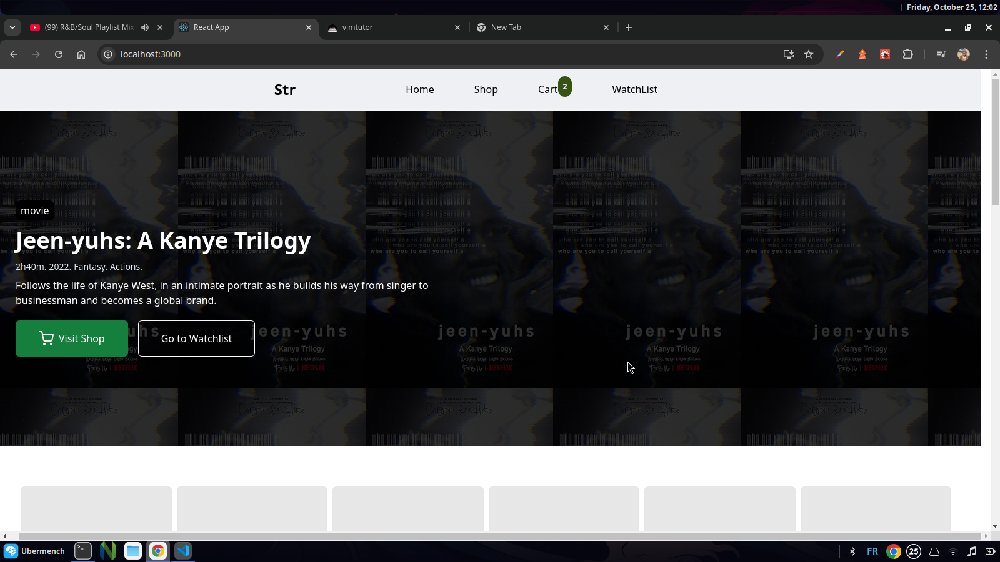
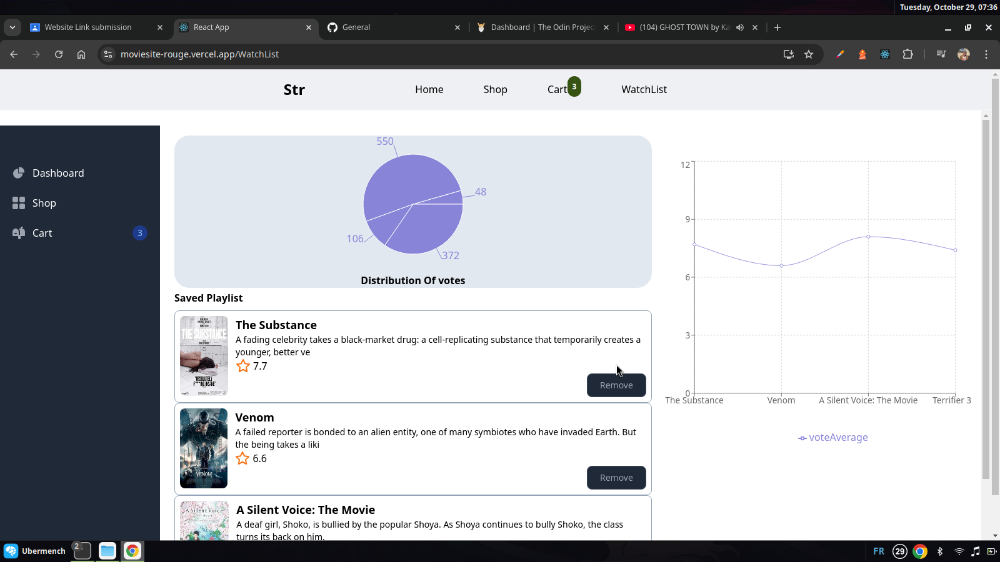

# MOVIE ANALYSIS DASHBOARD + E-COMMERCE

### Short Description
This is a web-app that allows one to add their favourite movies in the watchlist and be able to review
the trends to make a judgement on it. It also has an element of E-COMMERCE where the person can add the movie into cart




### Technology Used
1. Typescript
1. React
1. tmbp api
1. Tailwind css
1. Flowbite components
1. Figma
1. CSS
1. Git + Github 

### Installation 
1. ````bash

$ git clone  git@github.com:Mtendekuyokwa19/moviesite.git 
$ cd moviesite
$ npm start 

### Notes
1. Practice more lighthouse and seo skills
1. light+darkmode optimization

